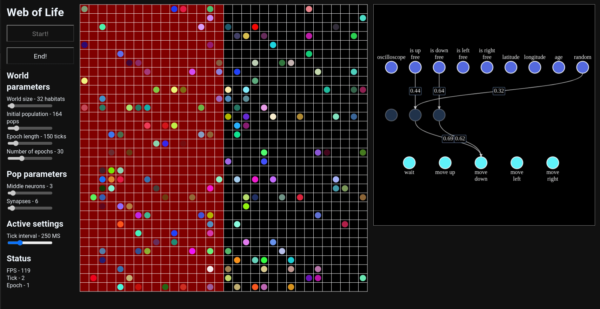

# Web of Life

## [Live Demo]()

Game of life like program to simulate `pops` occupying `habitats`

## Features

- Generates `habitat` squares and their inhabiting `pops`
- Runs the `simulation` where on each tick `pops` execute an action
- Currently pops randomly execute on of these actions:
  - Wait
  - Move up
  - Move down
  - Move left
  - Move right
- Configurable initial simulation parameters:
  - World size
  - Initial population
- Configurable settings:
  - Time interval between ticks (0 will update the simulation on each frame)
- Reports simulation satus:
  - Actual rendered FPS (Updates interval 1 second)

### Technical

- Written in `TypeScript`
- Uses `React` and `sass` for the UI elements
- Renders the simulation in `<canvas />` component
- Experimented writing the simulation and rendering engine in functional programming

## Development

- clone this repo
- install npm packages - `yarn`
- run locally - `yarn dev`
